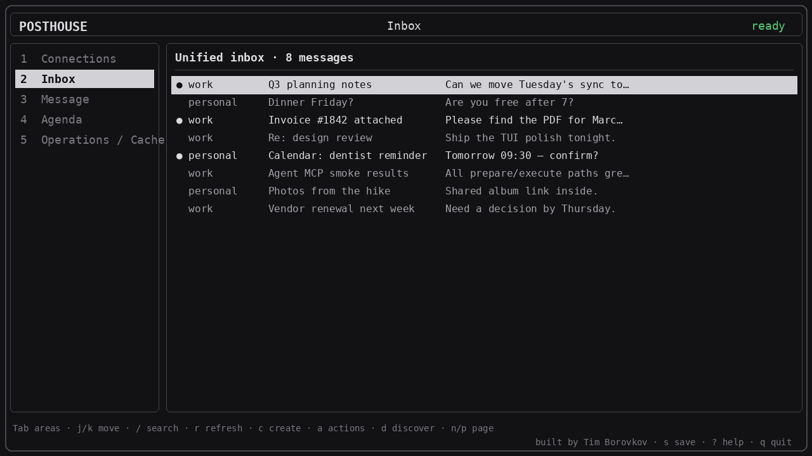

# Posthouse

[](https://github.com/timborovkov/posthouse/actions/workflows/ci.yml)
[](LICENSE)

**One local switchboard across your mail and calendars — ready for your agents.**

You juggle work and personal mailboxes, a few calendars, and maybe an agent
that needs to read them. Providers do not speak the same language. Posthouse
does: search across connections, then preview and execute every write on
exactly one. It is personal software you run on a machine you control — CLI,
MCP, REST, and an optional terminal UI. Free and open source under MIT.



Built by [Tim Borovkov](https://timb.dev). Landing + privacy pages:
[`website/`](./website/).

v0.2. IMAP/SMTP, CalDAV, and ICS feeds today. OAuth / native Gmail and
Microsoft are on the roadmap — see [TODO.md](./TODO.md).

## Features

### Connections and selectors

| Idea | What it does |
| --- | --- |
| **Multiple connections** | Several mailboxes and calendars in one config (work + personal + …). |
| **Category** | One broad grouping per connection: `work` or `personal`. |
| **Labels** | Free markers you choose (`acme`, `finance`, `primary`) to select across connections. |
| **Capabilities** | What each connection can do: `mail.read`, `mail.send`, `calendar.read`, `calendar.write`. |
| **Selector** | Scope a read by connection IDs, category, labels, and/or capability. |
| **Identity** | The From name/address used when that connection acts externally. |

Reads may fan out across a selector. Every write targets **exactly one**
connection, with a ten-minute prepare → preview → execute flow.

### Mail

| Action | Notes |
| --- | --- |
| List / search | Unified inbox; filter by category, label, unread, query. |
| Get / attachments | Full message body; save attachments locally. |
| Send | Text or HTML (`--html` / `--html-file`); optional CC/BCC and file attachments. |
| Reply / forward | Prepare-then-execute; same preview safety. |
| Drafts | Create, update, delete. |
| Mark / move / archive / trash | Folder actions on one connection. |

### Calendar

| Action | Notes |
| --- | --- |
| List / get | Across CalDAV collections and read-only ICS feeds. |
| Create / update / delete | CalDAV writes with ETag checks; prepare-then-execute. |
| Portable ICS | Generate invitation/cancel files without a provider write. |
| Discover | Pull folders and calendar collections into config. |

### How you use it

| Surface | Best for |
| --- | --- |
| **CLI** | Scripts and JSON output (`posthouse mail search`, …). |
| **TUI** | Keyboard-first daily loop; optional — same operations as CLI/MCP. |
| **MCP** | Local `stdio` or Streamable HTTP for Claude, Cursor, Codex, Hermes, … |
| **REST** | `/v1` on a personal `posthouse serve` (access key required). |
| **Agent skills** | `posthouse skill install --agent …` ships `connections` / `mail` / `calendar` (plus `mcp` / `rest`). |

Recipients are raw addresses (no contacts registry). The TUI is optional.

## Install

```sh
go install github.com/timborovkov/posthouse/cmd/posthouse@latest
posthouse tui
```

Teach a local agent the CLI skills (Codex, Claude, Cursor, Hermes):

```sh
posthouse skill install --agent codex connections mail calendar
posthouse skill list
```

Add `--all` (or `mcp` / `rest`) when the agent should also use MCP or the HTTP API. Re-running install refreshes files and removes retired skill folders (`cli`, `email-inboxes`, `email-send`). `--agent codex` installs into `~/.agents/skills` and also refreshes `~/.codex/skills` for older Codex builds.

Non-technical path (first connection, agents, private server):
[GETTING-STARTED.md](./GETTING-STARTED.md).

Full CLI, MCP, REST, and deploy detail:
[INSTALLATION-AND-USAGE-GUIDE.md](./INSTALLATION-AND-USAGE-GUIDE.md).

Setup guides: [GETTING-STARTED.md](./GETTING-STARTED.md) (authoritative commands)
and the foldable [website/](./website/) pages (deploy on your domain; see
`#setup-railway` for Railway).

## Develop

Go 1.26.6. Clone, then:

```sh
go mod download
make validate
```

```sh
make build             # ./bin/posthouse
make generate          # regenerate TUI from internal/tui/app.gsx
make test              # unit tests, no Docker
make test-integration  # GreenMail + Radicale
make test-e2e          # CLI and MCP against local servers
make validate-all      # full release gate
```

No live provider accounts needed. Generated `_gsx.go` is committed; CI fails
if `make generate` would change it.

## Contributing

Open an [issue](https://github.com/timborovkov/posthouse/issues/new) if
something is missing or broken. PRs welcome — see
[CONTRIBUTING.md](./CONTRIBUTING.md). Do not paste secrets or message/event
content. Security: [SECURITY.md](./SECURITY.md).

## License

[MIT](LICENSE) — free to use, copy, modify, and share, including commercially.
Copyright (c) 2026 [Tim Borovkov](https://timb.dev) and Posthouse contributors.

Domain language: [CONTEXT.md](./CONTEXT.md).
